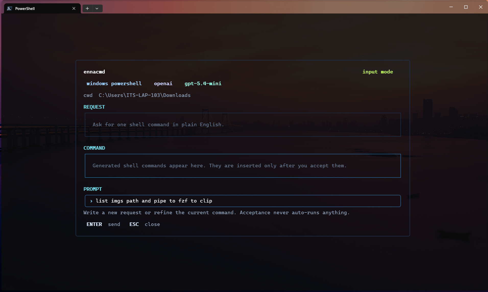
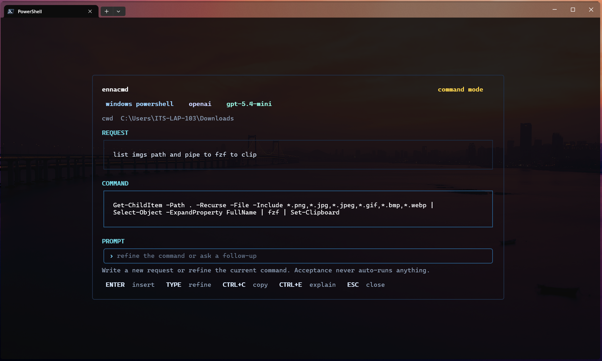

# ennacmd

`ennacmd` is a terminal-first assistant for generating, refining, and explaining shell commands.

It opens a focused TUI, converts plain-English intent into executable shell commands, and lets you review, refine, copy, or accept the result. It does not run commands for you.

## Screenshots

Input mode



Command mode



## Highlights

- Terminal UI built with Bubble Tea and Lip Gloss
- Shell-aware command generation for PowerShell, bash, zsh, and fish
- Provider support for OpenAI-compatible APIs, OpenRouter, and Ollama
- First-run setup flow with live provider validation
- Command refinement, explanation, copy, and accept flows
- Prompt insertion on supported terminals when a command is accepted
- Built-in shell integration commands for zsh, bash, fish, and PowerShell

## Installation

### Install with Go

Because the repository root is now the executable package, the install command is the clean public form:

```bash
go install github.com/thalha-dev/ennacmd@latest
```

To install a specific tagged release:

```bash
go install github.com/thalha-dev/ennacmd@v0.1.0
```

### Build from source

```powershell
go build ./...
New-Item -ItemType Directory -Force .\bin | Out-Null
go build -o .\bin\ennacmd.exe .
```

## Quick Start

Run:

```text
ennacmd
```

On first launch, `ennacmd` opens interactive setup when the config is missing or incomplete. The setup flow:

- lets you choose a provider
- asks for the model name
- collects provider-specific settings such as API keys and base URLs
- validates the provider configuration before saving it
- opens the main UI immediately after successful setup

To rerun setup later:

```text
ennacmd setup
```

## Shell Integration

Windows consoles expose a real input queue, so plain `ennacmd` can insert the accepted command directly.

Unix shells are different: a child process usually cannot rewrite the parent shell's prompt buffer reliably. The supported fix is the built-in shell integration flow, which uses `ennacmd --capture` under the hood and lets the shell place the accepted command back into its own line editor.

Install the integration for your current shell once:

```text
ennacmd shell-install
```

Run `shell-install` from the actual `ennacmd` binary you plan to keep using. The generated integration records that binary path, so rerun `shell-install` if you move the binary later.

Or print the script if you prefer to source it manually:

```text
ennacmd shell-init zsh
ennacmd shell-init bash
ennacmd shell-init fish
ennacmd shell-init powershell
```

Integration behavior differs by shell:

- `zsh` keeps the plain `ennacmd` command UX by wrapping `ennacmd` itself and pushing the accepted command back into the next prompt.
- `bash` installs a `Ctrl+G` binding that opens `ennacmd` and inserts the accepted command with Readline.
- `fish` installs a `Ctrl+G` binding that opens `ennacmd` and inserts the accepted command with `commandline`.
- `powershell` integration can be printed with `shell-init`, but Windows already supports direct insertion without it.

### zsh

The generated integration is equivalent to:

```zsh
function __ennacmd_capture() {
  local command
  command="$(ennacmd --capture)"
  if [[ -n "$command" ]]; then
    LBUFFER+="$command"
  fi
  zle redisplay
}

zle -N __ennacmd_capture
bindkey '^G' __ennacmd_capture
```

After `ennacmd shell-install`, keep using plain `ennacmd`.

### bash

The generated integration is equivalent to:

```bash
__ennacmd_capture() {
  local command
  command="$(ennacmd --capture)"
  if [[ -n "$command" ]]; then
    READLINE_LINE="$command"
    READLINE_POINT=${#READLINE_LINE}
  fi
}

bind -x '"\C-g":__ennacmd_capture'
```

After `ennacmd shell-install`, press `Ctrl+G` to open `ennacmd` and insert the accepted command.

### fish

The generated integration is equivalent to:

```fish
function __ennacmd_capture
    set -l command (ennacmd --capture)
    if test -n "$command"
        commandline --insert -- $command
    end
    commandline -f repaint
end

bind \cg __ennacmd_capture
```

After `ennacmd shell-install`, press `Ctrl+G` to open `ennacmd` and insert the accepted command.

## Commands

```text
ennacmd
ennacmd --capture
ennacmd shell-init [shell]
ennacmd shell-install [shell]
ennacmd setup
ennacmd version
```

## Keyboard Controls

- `Enter` in input mode sends your request
- `Enter` in command mode accepts the current command
- `Type` in command mode starts a refinement
- `Ctrl+C` copies the current command and closes
- `Ctrl+E` shows an explanation for the current command
- `Esc` closes the UI

## Configuration

`ennacmd` stores user data in:

- `~/.ennacmd/config.yaml`
- `~/.ennacmd/cache/`

Default configuration:

```yaml
provider: openai
base_url: https://api.openai.com/v1
api_key: ""
model: gpt-4o-mini
temperature: 0.2
shell: auto
streaming: true
```

Provider notes:

- `openai` requires `api_key`
- `openrouter` uses `provider: openrouter` and `base_url: https://openrouter.ai/api/v1`
- `ollama` uses `provider: ollama` and typically `base_url: http://localhost:11434`

You can edit `config.yaml` manually after setup if needed.

## Behavior

Command generation is constrained intentionally:

- output is shell command text, not markdown
- explanations are only returned when requested
- syntax follows the detected shell
- commands are adapted to the current operating system

When you accept a command, `ennacmd` inserts it into the active prompt instead of executing it automatically.

On Windows, this uses the console input queue directly.

On Unix shells, reliable prompt insertion depends on shell integration. Plain `ennacmd` still attempts direct queued input as a best-effort fallback, but the supported path is `ennacmd shell-install`.

## Development

Project layout:

```text
main.go
internal/
  ai/
  app/
  clipboard/
  config/
  prompt/
  provider/
  shell/
  terminal/
  ui/
```

Useful local commands:

```powershell
go build ./...
go test ./...
go build -o .\bin\ennacmd.exe .
```

## Releases

This repository is set up for automatic tagged releases with GitHub Actions and GoReleaser.

Push a semantic version tag like `v0.1.0`, and the workflow will:

- run tests
- build release binaries for Windows, Linux, and macOS
- create or update the GitHub Release
- upload release archives and checksums automatically

The public install command is:

```bash
go install github.com/thalha-dev/ennacmd@latest
```
